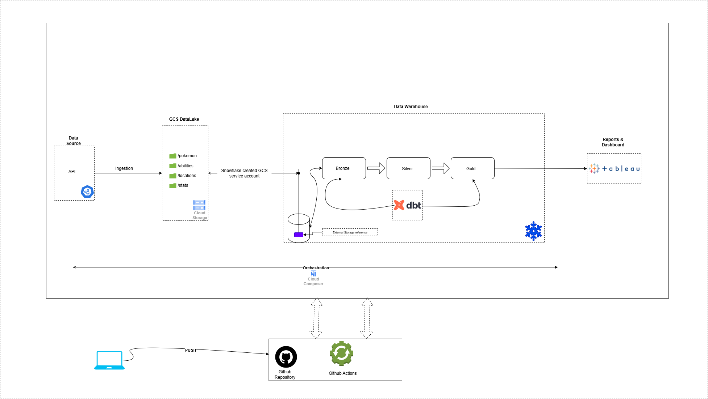

# Pokemon Data Pipeline

A modern, cloud-native data engineering pipeline that extracts, processes, and analyzes Pokémon data from the [PokéAPI](). It demonstrates the end-to-end flow of ingesting API data, storing it in a Google Cloud Storage (GCS) data lake, and loading it into Snowflake for downstream analytics.

### Why pokemon data set?

Pokémon api offers a rich public datasets—perfect for demonstrating real-world data engineering patterns such as batch ingestion, data modeling, and cloud-native analytics

The project will be divided into three parts:

1. Ingesting data from APIs to datalake.
2. Loading data from datalake to snowflake data warehouse.
3. Transforming data in a structured way for analytical queries.

---

## Architecture



1.  The data source for this project is the [PokeAPI](https://pokeapi.co/docs/v2), from which data will be ingested. The API provides multiple endpoints, each offering different categories of Pokémon-related data. Incoming data will be in JSON format.
2.  The ingestion will be performed as a daily batch process using python.
3.  Data collected from the API endpoints is stored in a GCS data lake in the following structure and format:

```
    pokemon-datalake/ # Name of the GCS bucket
    │
    ├── pokemon/ # Dataset representing the 'pokemon' endpoint
    │   └── pokemon_DDMMYYYY.parquet
    ├── moves/  # Dataset representing the 'moves' endpoint
    │   └── moves_DDMMYYYY.parquet
    ├── archive/    # Folder for archiving historical data
        └── pokemon/
            └── YYYY
                └── MM/
                    └── DD/
                        └── pokemon_DDMMYYYY.parquet
```

4. Once the data is ingested and stored in Google Cloud Storage (GCS), a Storage Integration is set up in Snowflake to create an external stage. This allows Snowflake to securely read data directly from the GCS bucket for further processing and loading.
5. Data transformations are performed using dbt, structured according to the Medallion Architecture. This approach organizes data into Bronze (raw), Silver (cleaned), and Gold (aggregated or business-ready) layers for better modularity and scalability.
6. Aggregated data from the Gold layer is visualized using Tableau to generate insightful dashboards and reports.
7. Data orchestration is managed using Cloud Composer (Airflow), which schedules and manages ingestion workflows.
8. Both orchestration (DAGs) and transformation (dbt) workflows are version-controlled and deployed through GitHub Actions.

---

## Setup Instructions

1. As a prerequisite for this project, both a GCP and a Snowflake account are required. Please ensure that the necessary accounts are set up before proceeding.

---
